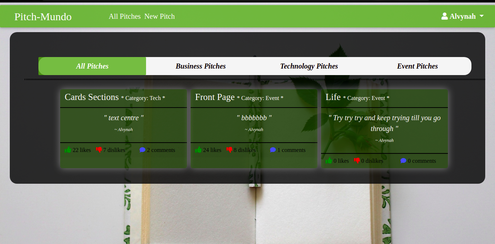
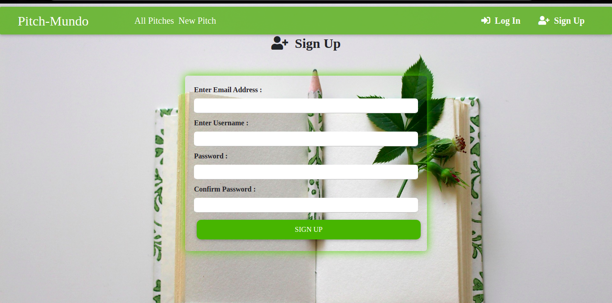
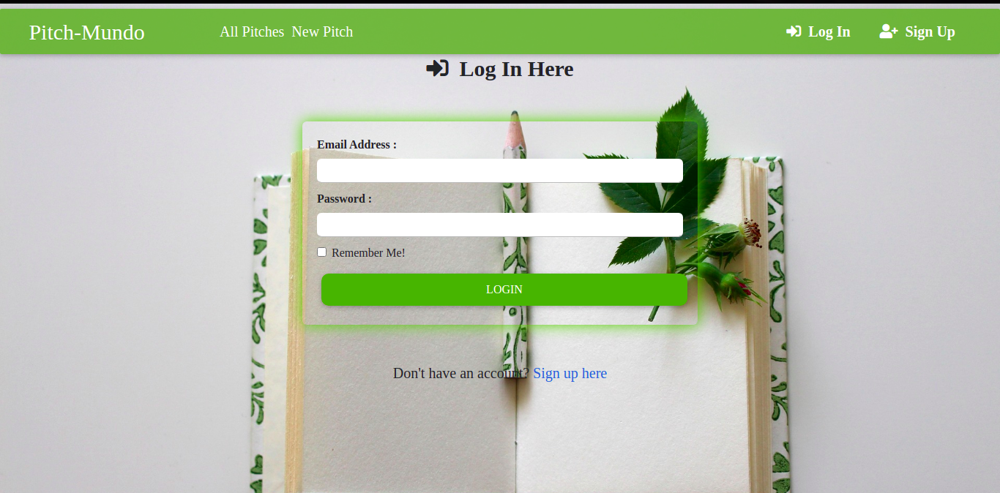
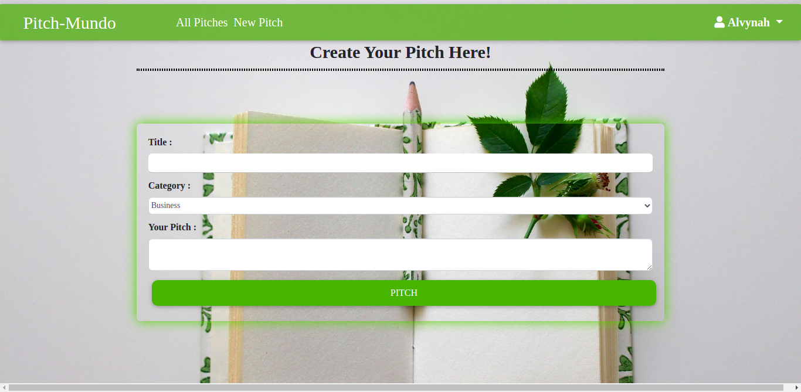
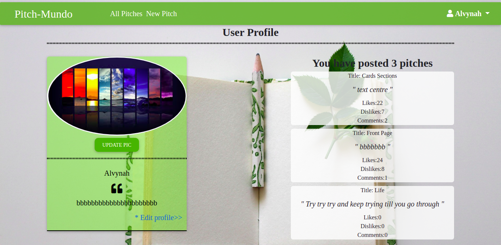

# PITCH MUNDO Description
A platform where users can enter a one minute pitch that can be life changing.Other users can then be able to view these pitches, upvote, down vote and add comments.The applications requires users to sign up and login to their accounts before perfoming any action.

## Author
 [Alvynah Wabwoba](https://github.com/alvynah)

## Screenshot
1. Landing page
    

2. Sign in Page
    

3. Login page
    

4. New pitch
    

5. Profile

## Live Link

## User Story

1. As a user, I would like to see the pitches other people have posted.
2. As a user, I would like to vote on the pitch they liked and give it a downvote or upvote.
3. As a user, I would like to be signed in for me to leave a comment
4. As a user, I would like to receive a welcoming email once I sign up.
5. As a user, I would like to view the pitches I have created in my profile page.
6. As a user, I would like to comment on the different pitches and leave feedback.
7. As a user, I would like to submit a pitch in any category.
8. As a user, I would like to view the different categories.

## Behaviour Driven Development (BDD)
1. Sign Up

|Behaviour 	           |    Input 	                 |       Output          |
|----------------------------------------------|:-----------------------------------:|-----------------------------:|       
|    Select sign up from the navigation bar    |    Email, Username, Password|  User is redirected to log in page   |  

2. Log in

|Behaviour 	           |    Input 	                 |       Output          |
|----------------------------------------------|:-----------------------------------:|-----------------------------:|       
|    Select login from the navigation bar / actions that redirect to login    |    Email, password |  User is authenticated and redirected to landing page|  

3. New Pitch

|Behaviour 	           |    Input 	                 |       Output          |
|----------------------------------------------|:-----------------------------------:|-----------------------------:|       
|    User selects new pitch from navigation bar    |    Title, Pitch, Category|  User is redirected to landing page where the created pitch is displayed   |  

4. Upvote Pitch

|Behaviour 	           |    Input 	                 |       Output          |
|----------------------------------------------|:-----------------------------------:|-----------------------------:|       
|    Click on the upvote icon on the pitch   |    upvote|  The number of likes is incremented by one on each click  |  

5. Downvote Pitch

|Behaviour 	           |    Input 	                 |       Output          |
|----------------------------------------------|:-----------------------------------:|-----------------------------:|       
|    Click on the downvote icon on the pitch   |    downvote|  The number of dislikes is incremented by one on each click  |  

6. Comment

|Behaviour 	           |    Input 	                 |       Output          |
|----------------------------------------------|:-----------------------------------:|-----------------------------:|       
|    Click on the comment icon on the pitch   |    comment|  The user is redirected to a page where they can comment and see other comments on that pitch  |  

## Setup/Installation Requirements
### Getting the code
1. clone repository
    https://github.com/alvynah/pitch-mundo.git
    
2. Move to the folder and install requirements
    cd pitch-mundo
    pip install -r requirements.txt
### Running the Application
1. Run main apllication
   * Change in manage.py create_app('development')
2. Run tests
    * Change in manage.py create_app('test')
   * python3.6 manage.py test

## Technologies Used

* Python3.6
* Flask framework
* Bootstrap
* PostgreSQL

## Contact Information
For any further inquiries or contributions or comments, reach me at [Alvynah](juvatalvynah@gmail.com)
### License
[MIT License](https://github.com/alvynah/pitch-mundo/blob/master/License)

Copyright (c) 2021 **Alvynah Wabwoba**